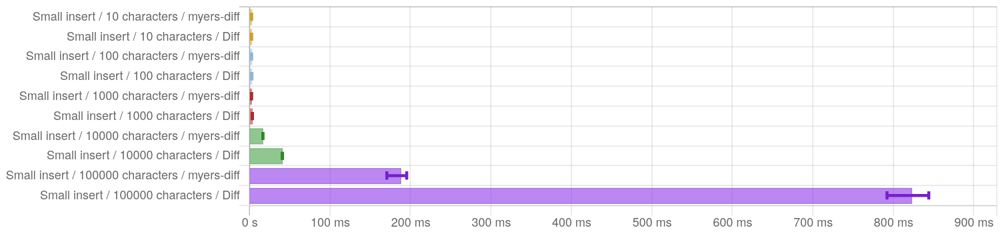
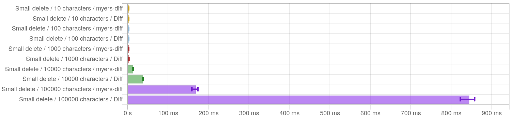

# Welcome to `myers-diff`  

This is a fast Haskell implementation of the Myers text diff algorithm[^1]. It is heavily inspired by the Python version in [this post](https://blog.robertelder.org/diff-algorithm/), and should have the same $O(\min(len(a), len(b)))$ space complexity. The implementation uses unboxed mutable vectors for performance.

This repo also can also build a couple other versions for benchmarking comparison, gated behind flags.

* `-funi_myers` will build the version from the [uni-util](https://hackage.haskell.org/package/uni-util-2.3.0.3/docs/Util-Myers.html) package.
* `-fdiff` will use the [Diff](https://hackage.haskell.org/package/Diff) package.

## Comparison to other libraries

The [Diff](https://hackage.haskell.org/package/Diff) package also implements the Myers algorithm, but a less space-efficient variant. That package advertises $O(D^2)$ space complexity, where $D$ is the number of differences between the two inputs. In the worst case, $D = \max(len(a), len(b))$, so the space usage can be quadratic in the input length.

[^1]: E. Myers (1986). "An O(ND) Difference Algorithm and Its Variations". Algorithmica. 1 (2): 251–266. CiteSeerX [10.1.1.4.6927](https://citeseerx.ist.psu.edu/viewdoc/summary?doi=10.1.1.4.6927). doi:[10.1007/BF01840446](https://doi.org/10.1007%2FBF01840446). S2CID [6996809](https://api.semanticscholar.org/CorpusID:6996809).

## Benchmarks

You can generate all the benchmarks by running `./run_all_benchmarks.sh`. Full results can be found in `./benchmark_results`. All benchmarks were run on an Intel i9-13900K.

TL;DR:
* These benchmarks focus on inputs of different sizes, where a single ~30 character region is either inserted or deleted.
* `myers-diff` is faster by around 2.5x, and the advantage grows with larger inputs (around 100k characters).
* `myers-diff` is more space-efficient by 5x for tiny inputs, shrinking to 1.5x for 10k character inputs and 1.3x for 100k character inputs.

Other benchmarks could be run, of course. Future work could involve testing inputs with multiple separated edits, and/or edits of different sizes. Please file an issue if you'd like to discuss a particular workload.

### Time: small inserts

**Test scenario**: generate a random input of $N$ characters, then insert a random string of $\leq 30$ characters somewhere to produce a modified input. Generate 100 such pairs and compare the diffing time of `myers-diff` with `Diff` using [criterion](https://hackage.haskell.org/package/criterion).

| Input size (chars) | myers-diff | Diff | Speedup |
| ----------- | ----------- | ----------- | ----------- |
| 10  | 408us | 1.07ms | 2.6x |
| 100 | 587us | 1.53ms | 2.6x |
| 1000 | 1.81ms | 3.46ms | 1.9x |
| 10000 | 16.6ms | 40.8ms | 2.5x |
| 100000 | 188ms | 823ms | 4.4x |

### Time: small deletes

**Test scenario**: same as for small inserts, but this time delete $\leq 30$ characters from the second input.

These results are very similar to those for small inserts.

### Space: small inserts

**Test scenario**: same as for the small inserts time test. In this test, we measure the bytes allocated by the diffing process using [weigh](https://hackage.haskell.org/package/weigh).

|Input size (chars)|myers-diff (bytes)|Diff (bytes)| Diff / myers-diff|
|---|---|---|---|
|10|1,681,120|8,904,176|5.3x|
|100|3,619,928|13,833,520|3.8x|
|1000|20,044,048|31,669,480|1.6x|
|10000|171,103,240|250,594,080|1.5x|
|100000|1,666,421,824|2,172,753,512|1.3x|
